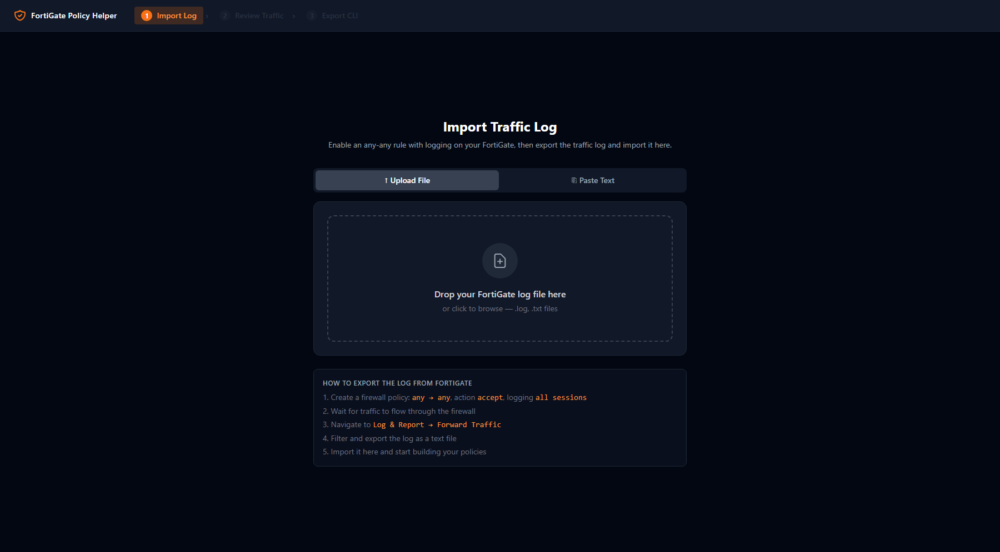
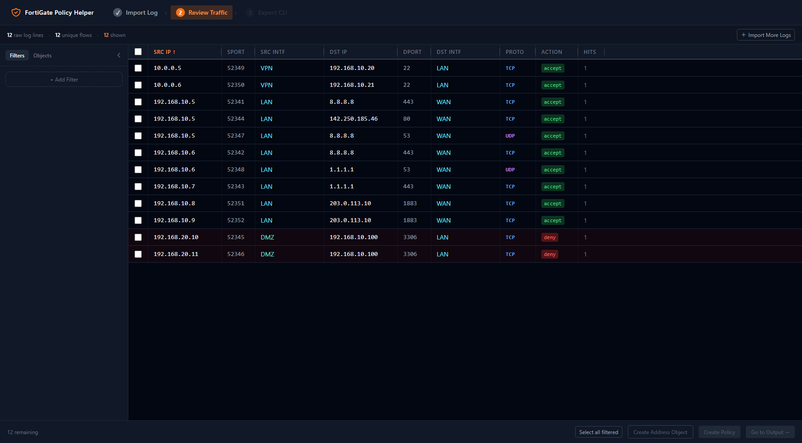
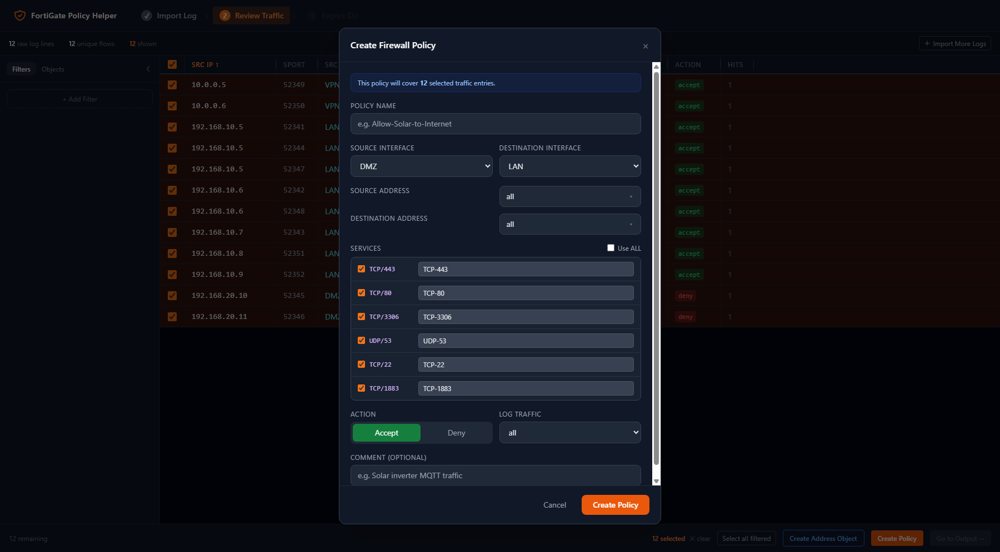
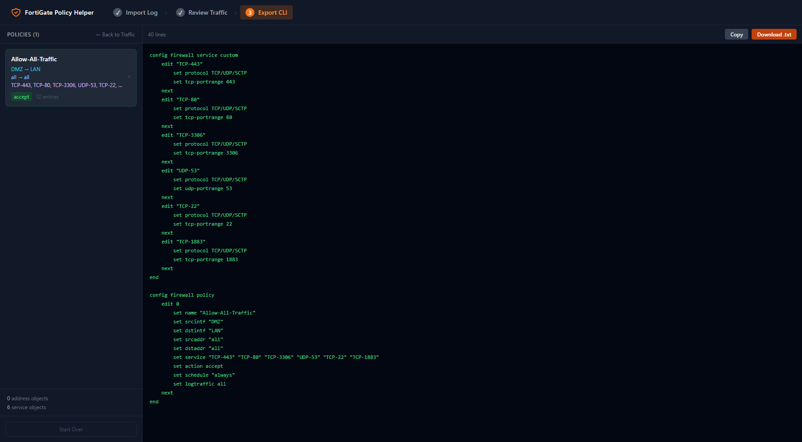

# FortiGate Policy Creation Helper

A client-side web app that helps you build precise FortiGate firewall policies from traffic logs — no backend, no server, everything runs in your browser.

## Screenshots

### Step 1 — Import Traffic Log


### Step 2 — Review Traffic


### Step 3 — Create Firewall Policy


### Step 4 — Export CLI Script


---

## The Problem

When setting up a FortiGate firewall from scratch, the typical workflow is:
1. Enable an any-any policy with logging (learning mode)
2. Let traffic flow for a while
3. Export the traffic log
4. Manually read through hundreds of log lines and hand-write CLI configs

This app automates step 4.

## Features

### Import
- **Log Import** — paste or upload a FortiGate traffic log (`.log` / `.txt`, up to 100 MB)
- **Parse Error Details** — collapsible list of lines that failed to parse, so you can spot format issues immediately
- **Automatic Deduplication** — identical 7-tuple flows are collapsed into one row with a hit count

### Traffic Review
- **Advanced Filtering** — filter by source/destination IP (exact, CIDR, range), port range, interface, protocol, or action with combinable AND/OR row logic
- **Selection Sync** — selection is automatically pruned when filters change so stale IDs never carry over
- **Consumed Entry Toggle** — show or hide entries already covered by a policy

### Policy Creation
- **Address Objects** — select entries and create host/subnet/range address objects with auto-suggested subnet
- **Policy Modal** — interfaces, addresses and services are pre-filled from the selection; smart address matching highlights the best-fit object
- **Batch by Interface** — one click creates one policy per uncovered `srcintf → dstintf` pair with editable names and addresses
- **Policy Editing** — double-click any policy in the output view to edit it

### Output
- **Coverage Stats** — colour-coded progress bar with Total / Covered / Uncovered counters
- **Coverage Gaps Panel** — uncovered entries grouped by interface pair with direct "Fix →" links back to traffic view
- **Conflict Detection** — ⚠ badge on policies that share the same interface pair
- **CLI Export** — ready-to-paste FortiGate CLI script with all address objects, service objects and policies in correct order; download filename includes a `YYYYMMDD-HHMMSS` timestamp
- **Policy Reordering** — move policies up/down to control hit order

### Reliability & UX
- **Undo / Redo** — full history stack (Ctrl+Z / Ctrl+Y) for all create/delete/reorder actions
- **Session Persistence** — state is saved to `localStorage` and restored on reload
- **Keyboard Shortcuts** — Ctrl+Z undo, Ctrl+Y / Ctrl+Shift+Z redo, Escape closes any modal
- **CLI String Escaping** — backslashes and quotes in names are correctly escaped for FortiGate CLI

## Workflow

```
Import Log → Review Traffic → Create Objects & Policies → Copy CLI Script
```

1. **Import** — paste your FortiGate log or drop a `.log` / `.txt` file
2. **Traffic Review** — filter by IP, port, interface, protocol; select entries you want to cover
3. **Create Objects & Policies** — build address objects from selected IPs, then create a policy, or use **Batch by Interface** to cover all remaining traffic at once
4. **Output** — review coverage stats and conflict warnings, reorder policies if needed, then copy or download the CLI script and paste it into your FortiGate

## Tech Stack

- React 18 + TypeScript
- Vite
- Tailwind CSS
- Zustand (state management)
- @tanstack/react-virtual (virtualized table for large logs)

## Getting Started

```bash
npm install
npm run dev
```

Open [http://localhost:5173](http://localhost:5173) in your browser.

## Build

```bash
npm run build
```

The output goes to `dist/` and can be served from any static file host.

## FortiGate Log Format

The app expects standard FortiGate traffic logs in key=value format:

```
date=2024-01-15 time=10:23:45 type="traffic" subtype="forward" srcip=192.168.10.5 srcport=443 srcintf="LAN" dstip=8.8.8.8 dstport=443 dstintf="WAN" proto=6 action="accept"
```

Required fields: `srcip`, `srcport`, `srcintf`, `dstip`, `dstport`, `dstintf`, `proto`

## CLI Output Example

```
config firewall address
    edit "LAN-192.168.10.0"
        set type ipmask
        set subnet 192.168.10.0 255.255.255.0
    next
end

config firewall service custom
    edit "TCP-443"
        set protocol TCP/UDP/SCTP
        set tcp-portrange 443
    next
end

config firewall policy
    edit 0
        set name "Allow-LAN-to-WAN"
        set srcintf "LAN"
        set dstintf "WAN"
        set srcaddr "LAN-192.168.10.0"
        set dstaddr "all"
        set service "TCP-443"
        set action accept
        set schedule "always"
        set logtraffic all
    next
end
```
